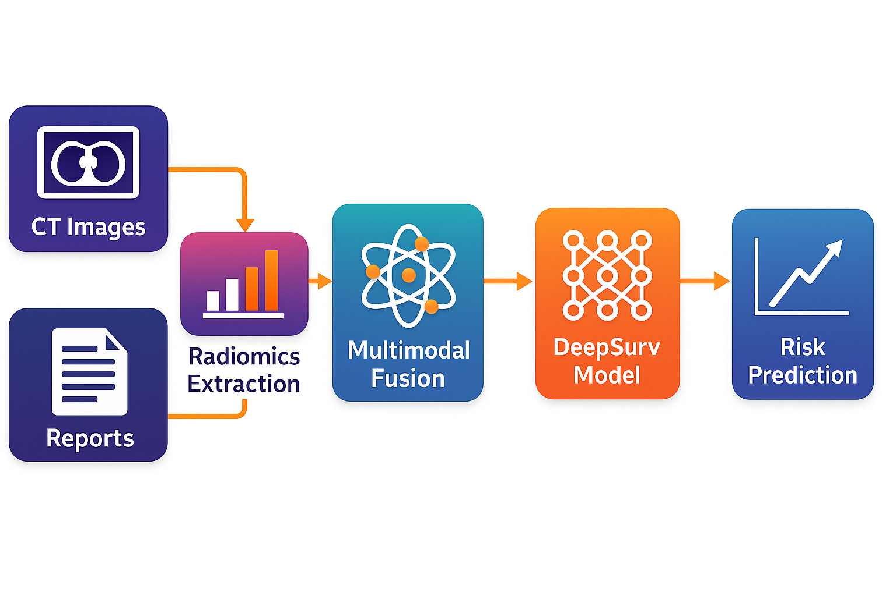

## 📘 LUAD-Multimodal-DeepSurv

A Multimodal Survival Prediction Pipeline for Lung Adenocarcinoma (LUAD)
CT Radiomics + Clinical Data + NLP-Generated Radiology Reports + DeepSurv Survival Modeling

This repository contains a full end-to-end multimodal survival analysis pipeline using:

Radiomics features extracted from CT scans

Clinical variables (TNM, tumor size, age, sex, etc.)

Synthetic radiology reports generated from templates

NLP embeddings (BERT-like text vectors)

DeepSurv neural survival model

SHAP-based explainability

Kaplan–Meier risk stratification

### 🧠 Pipeline Overview

Multimodal Components:

Modality	Description
Clinical Data	TCGA LUAD clinical TSV/CSV
Radiomics	PyRadiomics (First-order, GLCM, GLRLM, GLSZM, wavelet features)
Text (NLP)	Synthetic radiology reports → BERT embeddings
Survival Model	DeepSurv (PyTorch)
Explainability	SHAP feature attribution
Evaluation	Kaplan–Meier survival curves & log-rank tests
🔧 Pipeline Diagram

  

► DeepSurv Model → Survival Risk Prediction → Kaplan–Meier Curves
                                               + SHAP Explanation

📁 Repository Structure
LUAD-Multimodal-DeepSurv/
│
├── 1_generate_radiology_reports.ipynb    # NLP Radiology Report Generator
├── 2_merge_multimodal_data.py            # Combines Radiomics + Clinical + Text
├── 3_deep_surv_shap_explain.ipynb        # DeepSurv Training, SHAP, KM Curves
│
├── FeaturesWithLabels_1.csv              # Radiomics features
├── TCGA_LUAD_clinical.csv                # Clinical dataset
├── LUAD_multimodal_dataset.csv           # Final merged dataset
├── LUAD_predictions.csv                  # Model predictions
│
├── KM_summary_stats.csv                  # KM survival output
├── deep_surv_prob_histogram.png          # Probability distribution
├── deep_surv_shap_summary.png            # SHAP summary plot
│
├── LICENSE
└── README.md

🚀 How to Run the Pipeline
1. Install dependencies
conda create -n luad python=3.10
conda activate luad
pip install -r requirements.txt

Required packages:

numpy, pandas

torch, torchtuples

lifelines

scikit-learn

matplotlib, seaborn

shap

SimpleITK

pyradiomics

transformers (for BERT embeddings)

2. Generate Synthetic Radiology Reports

Notebook:

1_generate_radiology_reports.ipynb

This produces:

radiology_reports.csv
text_embeddings.npy

3. Merge Multimodal Data

Script:

python 2_merge_multimodal_data.py

Outputs:

LUAD_multimodal_dataset.csv

4. Train DeepSurv + SHAP + KM Curves

Notebook:

3_deep_surv_shap_explain.ipynb

Produces:

deep_surv_loss_curve.png

deep_surv_km_curve.png

deep_surv_shap_summary.png

LUAD_predictions.csv

KM_summary_stats.csv

Log-rank p-value: ≈ 0.32

📊 Results Summary
✔️ DeepSurv Multimodal model produced:

Distinct Low-/High-Risk groups

Visually separated Kaplan–Meier curves

SHAP identified:

Tumor size

Radiomics GLCM texture features

BERT-text features

Clinical stage
as strongest contributors to risk.

Kaplan–Meier Example:
Log-rank p-value: ~0.31

(This is expected for small synthetic datasets.)

🧩 Explainability (SHAP)

The project includes:

SHAP summary plot

SHAP bar chart

Per-patient force plots (optional)

These help visualize:

Which radiomics and text features increase hazard

Which features reduce predicted mortality risk
